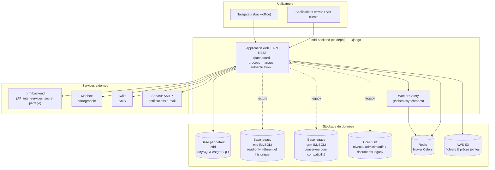
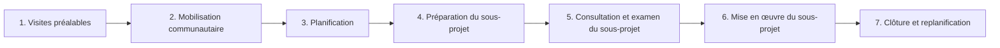

# CDD Backend

Backend Django de la plateforme **CDD** (*Community-Driven Development*) du projet **COSO** : suivi du cycle de vie des sous-projets communautaires (mobilisation, planification, exécution, clôture) à travers la hiérarchie administrative d'un pays (région → préfecture → commune → canton → village).

Ce dépôt est l'un des trois services applicatifs de l'écosystème COSO, aux côtés de :
- **grm-backend** — Grievance Redress Mechanism (gestion des plaintes)
- **MIS** — système d'information et de gestion (référentiel historique des niveaux administratifs)

## Sommaire

- [Description](#description)
- [Architecture générale](#architecture-générale)
- [Domaine métier](#domaine-métier)
- [Applications Django](#applications-django)
- [Stack technique](#stack-technique)
- [Structure du dépôt](#structure-du-dépôt)
- [Démarrage local](#démarrage-local)
- [Variables d'environnement](#variables-denvironnement)
- [Tests et qualité de code](#tests-et-qualité-de-code)
- [Déploiement](#déploiement)
- [Intégrations avec les services externes](#intégrations-avec-les-services-externes)
- [Internationalisation](#internationalisation)

## Description

CDD Backend est l'application centrale du dispositif de suivi communautaire COSO. Elle permet aux facilitateurs de terrain et aux équipes de supervision de :

- piloter le **cycle de vie des sous-projets** communautaires, phase par phase (visites préalables, mobilisation, planification, préparation, consultation, mise en œuvre, clôture) ;
- gérer la **hiérarchie administrative** du territoire d'intervention (région, préfecture, commune, canton, village) et les Comités Villageois de Développement (CVD) ;
- suivre les **facilitateurs communautaires** (ADL/EADL) et leurs affectations géographiques ;
- planifier et valider les **activités de terrain**, avec pièces jointes, géolocalisation et historique de validation ;
- produire des **statistiques, tableaux de bord et rapports** (export PDF, Excel/CSV) ;
- diffuser de l'**actualité**, du **matériel d'appui** pédagogique et des mini-applications via la « COSO Store » ;
- s'interfacer avec le module **GRM** (gestion des plaintes) et le **système MIS legacy** pour partager un référentiel commun.

L'interface utilisateur est un back-office serveur (Django Templates + Bootstrap 4) accompagné d'une API REST (Django REST Framework) consommée par les services soeurs et par les vues cartographiques (Mapbox GL / OpenLayers).

## Architecture générale



Points clés :
- **Base de données par défaut (`cdd`)** : source de vérité pour tout le nouveau modèle métier (sous-projets, cycles, facilitateurs, planning...).
- **Bases `mis` et `grm`** : connexions secondaires en lecture vers les bases legacy (`LEGACY_DATABASE_URL`, `LEGACY_GRM_DATABASE_URL`), utilisées pour la compatibilité avec l'historique.
- **CouchDB** : ancien stockage NoSQL (client `cloudant`, voir [no_sql_client.py](src/no_sql_client.py) et [cdd_client.py](src/cdd_client.py)). Une migration progressive est en cours : les accès directs à la base partagée `eadls` (facilitateurs/ADL) sont remplacés par des appels à l'**API inter-services de grm-backend** (voir [grm_client.py](src/grm_client.py)), désormais adossée à PostgreSQL côté GRM.
- **Celery + Redis** : traitement asynchrone (exports volumineux, synchronisations, notifications).
- **AWS S3** : stockage des fichiers uploadés (`django-storages`).
- **Authentification inter-services** : un secret partagé (`GRM_SECRET_KEY_GENRATE`) sécurise les échanges entre `cdd-backend` et `grm-backend` ; les trois façades (`CDD_URL_BASE`, `MIS_URL_BASE`, `GRM_URL_BASE`) sont mutuellement déclarées en CORS/CSRF trusted origins.

## Domaine métier

Le cœur du modèle (`process_manager`) organise le suivi d'un sous-projet selon la hiérarchie suivante :

```
Project (COSO)
 └─ Cycle (cycle d'investissement)
     └─ Phase
         └─ Activity
             └─ Task  (unité de travail assignée à un niveau administratif / facilitateur)
```

Chaque sous-projet traverse sept phases, dans l'ordre :



Chaque tâche possède un statut détaillé (`TASKS_STATUS` dans [constants.py](src/cdd/constants.py)) : *Not started → In progress → Completed awaiting validation → Validated*, avec gestion des invalidations et relances. Ces statuts sont agrégés par niveau administratif (`AggregatedStatus`) pour alimenter les tableaux de bord et statistiques.

La hiérarchie territoriale (`administrativelevels`) modélise : **Région → Préfecture → Commune → Canton → Village**, chaque niveau pouvant être rattaché à un **CVD** (Comité Villageois de Développement) et à une unité géographique (coordonnées, zone frontalière, rural/urbain).

## Applications Django

| Application | Rôle |
|---|---|
| `authentication` | Comptes, facilitateurs communautaires (ADL/EADL), authentification JWT/session |
| `dashboard` | Back-office principal : regroupe les sous-modules `diagnostics`, `facilitators`, `funnel`, `news`, `planning`, `process_manager`, `reports`, `statistics`, `storeapp`, `administrative_levels` |
| `process_manager` | Modèle de processus métier : projets, cycles, phases, activités, tâches, statuts agrégés, vagues de déploiement |
| `administrativelevels` | Hiérarchie géographique et CVD |
| `subprojects` | Sous-projets communautaires : priorités, obstacles, objectifs, groupes vulnérables, comités, financeurs, composantes |
| `planning` | Activités planifiées, validations, pièces jointes, commentaires, géolocalisation, échéances |
| `attachments` | Gestion générique des fichiers joints |
| `assignments` | Affectation des facilitateurs aux niveaux administratifs |
| `storeapp` | Catalogue de mini-applications exposées (« COSO Store ») |
| `supportmaterial` | Matériel pédagogique (sujets, leçons, supports) |
| `news` | Actualités, catégories, tags, abonnements |
| `reports` | Comités villageois, rapports et exports (PDF, Excel/CSV) |
| `usermanager` | Gestion des utilisateurs, codes de validation, réinitialisation de mot de passe |

## Stack technique

| Domaine | Technologie |
|---|---|
| Framework web | Django 4.0.4, Django REST Framework, drf-spectacular (OpenAPI/Swagger) |
| Authentification API | `djangorestframework-simplejwt` (JWT) + session Django |
| Bases de données | MySQL/PostgreSQL (`django-environ`, `psycopg2-binary`, `mysqlclient`) + connexions multiples (`default`, `mis`, `grm`) |
| Stockage documentaire legacy | CouchDB (`cloudant`) |
| Tâches asynchrones | Celery 5, résultats stockés en base (`django-celery-results`), broker Redis |
| Stockage de fichiers | AWS S3 (`django-storages`, `boto3`) |
| Frontend (back-office) | Templates Django, Bootstrap 4, AdminLTE, Mapbox GL JS / OpenLayers |
| Notifications | SMTP (e-mail), Twilio (SMS) |
| Export / Data | pandas, openpyxl |
| Qualité | flake8, pre-commit, pytest / pytest-django, factory-boy, Faker |
| Serveur applicatif | Gunicorn derrière Nginx |
| Déploiement | AWS Elastic Beanstalk (`.ebextensions`, `.platform`) |

## Structure du dépôt

```
cdd-backend/
└── src/
    ├── cdd/                     # Configuration du projet Django (settings, urls, celery, .env)
    ├── authentication/          # Facilitateurs & authentification
    ├── dashboard/               # Back-office (sous-modules métier)
    ├── process_manager/         # Cycles, phases, activités, tâches
    ├── administrativelevels/    # Hiérarchie géographique & CVD
    ├── subprojects/             # Sous-projets communautaires
    ├── planning/                # Planification d'activités
    ├── attachments/             # Pièces jointes génériques
    ├── assignments/             # Affectations facilitateur ↔ niveau administratif
    ├── storeapp/                # COSO Store
    ├── supportmaterial/         # Matériel d'appui
    ├── news/                    # Actualités
    ├── reports/                 # Comités villageois & rapports
    ├── usermanager/             # Gestion des utilisateurs
    ├── couchdb/design/          # Design documents CouchDB (legacy)
    ├── locale/                  # Fichiers de traduction (fr/en)
    ├── static/ · media/         # Assets statiques & médias
    ├── .ebextensions/ · .platform/  # Configuration AWS Elastic Beanstalk / Nginx
    ├── grm_client.py            # Client HTTP vers l'API inter-services grm-backend
    ├── no_sql_client.py         # Client CouchDB (legacy)
    ├── manage.py · Procfile · requirements*.txt
```

## Démarrage local

### Prérequis

- Python 3.8.10 (`runtime.txt`)
- Un serveur de base de données compatible (MySQL en local d'après `.env.example`, PostgreSQL supporté en production)
- CouchDB (pour les fonctionnalités encore dépendantes du legacy NoSQL)
- Redis (broker Celery), si les tâches asynchrones sont nécessaires

### Installation

```bash
cd cdd-backend/src

python -m venv venv
source venv/bin/activate        # ou venv\Scripts\activate sous Windows

pip install -r requirements.txt
pip install -r requirements_dev.txt   # outils de dev/test

cp cdd/.env.example cdd/.env
# éditer cdd/.env avec vos identifiants locaux (voir section suivante)

python manage.py migrate
python manage.py createsuperuser
python manage.py runserver
```

Pour les tâches asynchrones :

```bash
celery -A cdd worker -l info
```

L'API de documentation Swagger est disponible en mode `DEBUG` sur `/api/schema/swagger-ui/`, et un endpoint de santé est exposé sur `/health/`.

## Variables d'environnement

Configurées via `django-environ` dans [cdd/settings.py](src/cdd/settings.py), à définir dans `cdd/.env` (modèle : [cdd/.env.example](src/cdd/.env.example)).

| Variable | Description |
|---|---|
| `SECRET_KEY`, `DEBUG`, `ALLOWED_HOSTS` | Paramètres standards Django |
| `DATABASE_URL` | Base par défaut (`cdd`) |
| `LEGACY_DATABASE_URL` | Base legacy `mis` (référentiel historique, lecture) |
| `LEGACY_GRM_DATABASE_URL` | Base legacy `grm` (conservée pour compatibilité) |
| `NO_SQL_URL`, `NO_SQL_USER`, `NO_SQL_PASS` | Accès CouchDB legacy |
| `S3_BUCKET`, `S3_ACCESS`, `S3_SECRET`, `AWS_S3_REGION_NAME` | Stockage des fichiers sur AWS S3 |
| `MAPBOX_ACCESS_TOKEN`, `DIAGNOSTIC_MAP_*` | Configuration de la carte de diagnostic (centrage, zoom, emprise, code ISO du pays) |
| `EMAIL_*`, `DEFAULT_FROM_EMAIL`, `RECIPIENT_EMAIL_DEFAULT` | Envoi d'e-mails |
| `TWILIO_*` | Envoi de SMS |
| `CDD_URL_BASE`, `MIS_URL_BASE`, `GRM_URL_BASE` | URLs des trois façades applicatives (CORS/CSRF) |
| `GRM_SECRET_KEY_GENRATE` | Secret partagé pour les appels inter-services vers `grm-backend` |
| `TOKEN_ALLOWED_TO_ACCESS_API` | Liste de jetons autorisés pour certains accès API externes |

## Tests et qualité de code

```bash
pytest
```

- Configuration flake8 : [.flake8](.flake8) (longueur de ligne 120, exclusions migrations/manage.py)
- Hooks pre-commit : `flake8`, `check-yaml`, `end-of-file-fixer`, `trailing-whitespace` (voir `src/.pre-commit-config.yaml`)
- Fixtures de test : `factory-boy`, `Faker`
- Tests d'intégration existants sous `attachments/tests/integration_test`

## Déploiement

Le service est packagé pour **AWS Elastic Beanstalk** :

- `Procfile` : lance Gunicorn (`gunicorn --timeout 600 ... cdd.wsgi:application`)
- `.ebextensions/python.config` : dépendances système (libjpeg, libpng, libxml2/libxslt, connecteur MariaDB)
- `.ebextensions/django.config` : chemin WSGI et service des fichiers statiques
- `.ebextensions/01_files.config` / `.platform/nginx` : configuration des timeouts Nginx (600s) pour les traitements longs (exports, imports)
- `.ebextensions/loadbalancer-timeout.config` : timeout du load balancer aligné (600s)
- `.platform/hooks/predeploy/01_fix_setuptools.sh` : correctif de version `setuptools`/`wheel` avant déploiement

## Intégrations avec les services externes

- **grm-backend** : API inter-services authentifiée par secret partagé (en-tête `X-GRM-Secret`), utilisée pour récupérer les facilitateurs (ADL/EADL) par e-mail ou par village, et pour synchroniser les mots de passe entre comptes CDD et GRM (voir [grm_client.py](src/grm_client.py)). Cette API remplace progressivement les anciens accès directs à la base CouchDB partagée `eadls`.
- **MIS legacy** : connexion en lecture (`mis`) utilisée notamment pour reconstruire les arborescences administratives (canton/village) historiques.
- **AWS S3** : stockage centralisé des pièces jointes et exports.
- **Mapbox / OpenLayers** : cartographie des niveaux administratifs et diagnostics géographiques.
- **Twilio** et **SMTP** : notifications SMS et e-mail vers les facilitateurs et superviseurs.

## Internationalisation

- Langue par défaut : français (`fr`), anglais (`en`) disponible
- Fichiers de traduction : `src/locale/fr/LC_MESSAGES`
- Prise en compte du préfixe de langue dans les URLs (`django.middleware.locale.LocaleMiddleware`, `i18n_patterns`)
